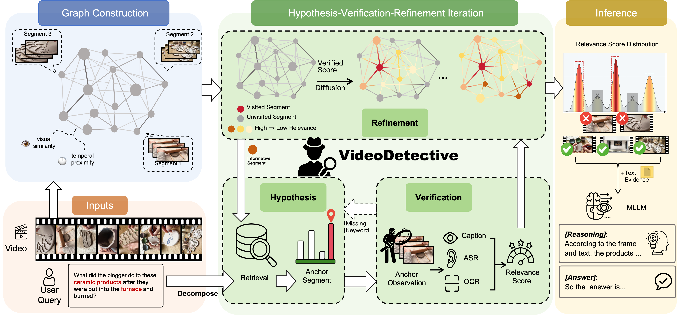
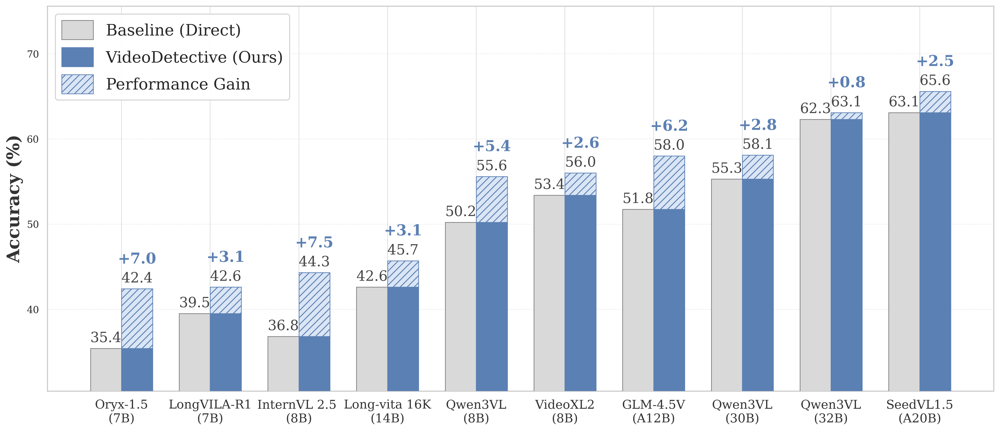

# VideoDetective

**VideoDetective** is a *plug-and-play* inference framework for **long-video multiple-choice question answering**. It localizes sparse, query-critical “clue” segments by combining:

- **Extrinsic query relevance** (what the question asks for), and
- **Intrinsic video structure** (how segments relate to each other via visual similarity + temporal continuity).

Instead of a one-shot query-to-video retrieval, VideoDetective maintains a **global belief field** over video segments and iteratively refines it via a **Hypothesis–Verification–Refinement** loop. This enables *“See Less but Know More”* under limited context / observation budgets.

This repository contains a runnable demo script: `scripts/test_run.py`.

## Contents

- [Overview](#overview)
  - [Motivation](#motivation)
  - [Key ideas](#key-ideas)
  - [Framework](#framework)
- [Results](#results)
- [Installation](#installation)
  - [Requirements](#requirements)
  - [Install dependencies](#install-dependencies)
- [Configuration](#configuration)
- [Inference](#inference)
  - [Quick start (single video)](#quick-start-single-video)
  - [Outputs](#outputs)
- [Core API](#core-api)
- [Citation](#citation)

## Overview

### Motivation

Long-video understanding is hard for modern MLLMs because **the context window is limited**: you cannot feed dense frames from an entire long video. Many existing “clue localization” methods are *query-only* (unidirectional query → video search). This can miss the fact that a video is not a bag of independent frames: it has **coherent temporal dynamics** and **intrinsic inter-segment correlations**.

VideoDetective is motivated by a simple principle:

- Use sparse observations to **estimate a global relevance distribution** over the whole video, rather than restarting from scratch when an early guess is wrong.

### Key ideas

- **Spatio-Temporal Affinity Graph**: chunk the video into semantic segments (nodes), connect them with edges from **visual similarity** and **temporal proximity**.
- **Hypothesis–Verification–Refinement**:
  - **Hypothesis**: pick the next anchor segment (active sampling).
  - **Verification**: “observe” the anchor with a VLM (plus optional ASR) and score relevance.
  - **Refinement**: diffuse sparse scores over the graph to update a **global belief field**.
- **Evidence packaging**: select a compact evidence set (frames + optional text evidence) for final answering.

### Framework



## Results
VideoDetective consistently enhances various MLLM across different architectures and parameter scales


## Installation

### Requirements

- **Python**: recommended 3.9+
- **ffmpeg**: required for audio extraction if ASR is enabled
  - macOS: `brew install ffmpeg`
  - Ubuntu/Debian: `sudo apt install ffmpeg`

### Install dependencies

```bash
python -m venv .venv
source .venv/bin/activate
pip install -r requirements.txt
```

## Configuration

1) Copy the template:

```bash
cp .env.example .env
```

1) Fill in at least the VLM API settings (OpenAI-compatible):

- `VIDEODETECTIVE_API_KEY`
- `VIDEODETECTIVE_BASE_URL` (e.g., DashScope / OpenAI / OpenRouter compatible base URL)
- `VIDEODETECTIVE_VLM_MODEL` (e.g., `qwen3-vl-8b-instruct`)

Others:

- **Text LLM (planner / query decomposition)** (falls back to VLM settings if not set)
  - `VIDEODETECTIVE_LLM_MODEL`
  - `VIDEODETECTIVE_LLM_API_KEY`
  - `VIDEODETECTIVE_LLM_BASE_URL`
- **Pipeline**
  - `VIDEODETECTIVE_MAX_FRAMES_PER_CALL`
  - `ENABLE_MULTI_ROUTE_RECALL`
  - `USE_VLM_RELEVANCE`
  - `INCLUDE_ANSWER_EVIDENCE`
- **ASR**
  - `VIDEODETECTIVE_ENABLE_ASR`
  - `VIDEODETECTIVE_WHISPER_MODEL`
  - `VIDEODETECTIVE_ASR_DEVICE`

Notes:

- Environment loading is implemented in `config/settings.py` and reads `.env` from the project root.
- `src/agent/llm_client.py` supports custom auth headers for some OpenAI-compatible proxies via:
  - `VIDEODETECTIVE_AUTH_HEADER_NAME`
  - `VIDEODETECTIVE_AUTH_PREFIX`

## Inference

### Quick start (single video)

```bash
python scripts/test_run.py \
  --video_path /path/to/video.mp4 \
  --question "What is the man doing?" \
  --options "A. Running, B. Walking, C. Sitting, D. Standing" \
  --output_dir output \
  --max_steps 10 \
  --total_budget 32
```

### Outputs

For each run, you should get:

- **Full results**: `output/<video_id>_results.json` (includes prediction, optional GT, and `debug_info`)

## Core API

Minimal usage in Python:

```python
from src.pipeline import VideoDetective

detective = VideoDetective(verbose=True)
result = detective.solve(
    video_path="/path/to/video.mp4",
    query="Question text. Options: A. ..., B. ..., C. ..., D. ...",
    max_steps=10,
    total_budget=32,
)
print(result.answer)
# result.debug_info contains debugging artifacts such as belief history.
```

## Citation

```bibtex
@misc{yang2026videodetective,
  title = {VideoDetective: Clue Hunting via both Extrinsic Query and Intrinsic Relevance for Long Video Understanding},
  author = {Yang Ruoliu and Wu, Chu and Shan Caifeng and He Ran and Fu Chaoyou},
  arxiv={}
  year = {2026}
}
```
