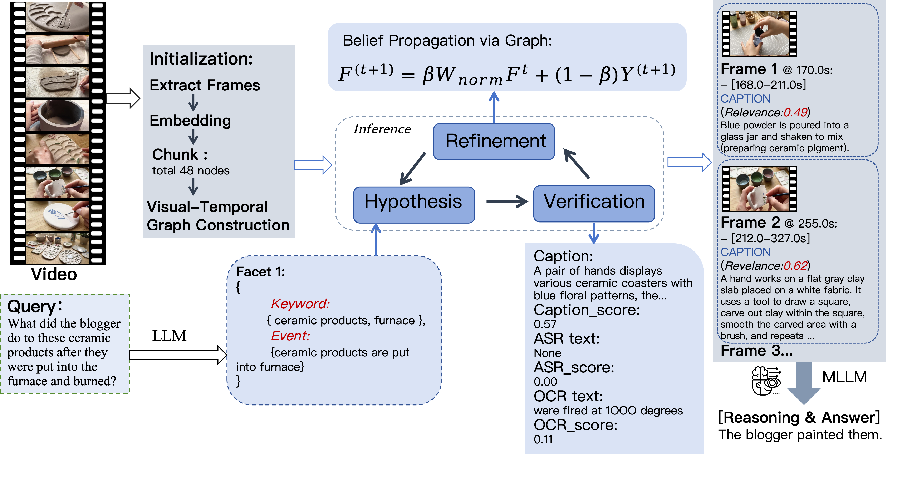

# VideoDetective

[](https://arxiv.org)
[]()
[](https://yangruoliu.github.io/VideoDetective)


**VideoDetective** is a *plug-and-play* inference framework for **long-video multiple-choice question answering**.

**Keywords**: long video understanding, video question answering, multimodal large language models

VideoDetective localizes sparse, query-relevant clue segments by integrating **extrinsic query relevance** with **intrinsic inter-segment affinity** for effective clue hunting under limited context windows.

This repository contains a runnable demo script: `scripts/test_run.py`.

## 📚 Contents

- [Overview](#overview)
  - [Motivation](#motivation)
  - [Key ideas](#key-ideas)
  - [Framework](#framework)
- [Results](#results)
- [Example](#example)
- [Installation](#installation)
  - [Requirements](#requirements)
  - [Install dependencies](#install-dependencies)
- [Configuration](#configuration)
- [Inference](#inference)
  - [Quick start (single video)](#quick-start-single-video)
  - [Outputs](#outputs)
- [Core API](#core-api)
- [Citation](#citation)

<a id="overview"></a>
## 🧭 Overview

<a id="motivation"></a>
### 🎯 Motivation

Long video understanding remains challenging for multimodal large language models (MLLMs) due to limited context windows, which necessitate identifying sparse query-relevant video segments. However, existing methods predominantly localize clues based solely on the query, overlooking the video’s intrinsic structure and varying relevance across segments. Motivated by this, VideoDetective jointly leverages the query and intrinsic inter-segment correlations to model a query-relevance distribution over the entire video under a limited observation budget (“See Less but Know More”).

<a id="key-ideas"></a>
### 💡 Key ideas

- **Visual–temporal affinity graph**: divide a video into segments and represent them as a visual–temporal affinity graph built from visual similarity and temporal proximity.
- **Hypothesis–Verification–Refinement loop**: estimate relevance scores of observed segments to the query and propagate them to unseen segments, yielding a global relevance distribution that guides localization of the most critical segments for final answering with sparse observation.

<a id="framework"></a>
### 🧩 Framework


<a id="results"></a>
## 📈 Results

VideoDetective consistently achieves substantial gains across a wide range of mainstream MLLMs.


 
<a id="example"></a>
## 🖼️ Example
 

 
<a id="installation"></a>
## 🛠️ Installation

<a id="requirements"></a>
### ✅ Requirements

- **Python**: recommended 3.9+
- **ffmpeg**: required for audio extraction if ASR is enabled
  - macOS: `brew install ffmpeg`
  - Ubuntu/Debian: `sudo apt install ffmpeg`

<a id="install-dependencies"></a>
### 📦 Install dependencies

```bash
python -m venv .venv
source .venv/bin/activate
pip install -r requirements.txt
```

<a id="configuration"></a>
## ⚙️ Configuration

1) Copy the template:

```bash
cp .env.example .env
```

1) Fill in at least the VLM API settings (OpenAI-compatible):

- `VIDEODETECTIVE_API_KEY`
- `VIDEODETECTIVE_BASE_URL` (e.g., DashScope / OpenAI / OpenRouter compatible base URL)
- `VIDEODETECTIVE_VLM_MODEL` (e.g., `qwen3-vl-8b-instruct`)

Others:

- **Text LLM (planner / query decomposition)** (falls back to VLM settings if not set)
  - `VIDEODETECTIVE_LLM_MODEL`
  - `VIDEODETECTIVE_LLM_API_KEY`
  - `VIDEODETECTIVE_LLM_BASE_URL`
- **Pipeline**
  - `VIDEODETECTIVE_MAX_FRAMES_PER_CALL`
  - `ENABLE_MULTI_ROUTE_RECALL`
  - `USE_VLM_RELEVANCE`
  - `INCLUDE_ANSWER_EVIDENCE`
- **ASR**
  - `VIDEODETECTIVE_ENABLE_ASR`
  - `VIDEODETECTIVE_WHISPER_MODEL`
  - `VIDEODETECTIVE_ASR_DEVICE`

Notes:

- Environment loading is implemented in `config/settings.py` and reads `.env` from the project root.
- `src/agent/llm_client.py` supports custom auth headers for some OpenAI-compatible proxies via:
  - `VIDEODETECTIVE_AUTH_HEADER_NAME`
  - `VIDEODETECTIVE_AUTH_PREFIX`

<a id="inference"></a>
## 🚀 Inference

<a id="quick-start-single-video"></a>
### ⚡ Quick start (single video)

```bash
python scripts/test_run.py \
  --video_path /path/to/video.mp4 \
  --question "What is the man doing?" \
  --options "A. Running, B. Walking, C. Sitting, D. Standing" \
  --output_dir output \
  --max_steps 10 \
  --total_budget 32
```

<a id="outputs"></a>
### 🗂️ Outputs

For each run, you should get:

- **Full results**: `output/<video_id>_results.json` (includes prediction, optional GT, and `debug_info`)

<a id="core-api"></a>
## 🧪 Core API

Minimal usage in Python:

```python
from src.pipeline import VideoDetective

detective = VideoDetective(verbose=True)
result = detective.solve(
    video_path="/path/to/video.mp4",
    query="Question text. Options: A. ..., B. ..., C. ..., D. ...",
    max_steps=10,
    total_budget=32,
)
print(result.answer)
# result.debug_info contains debugging artifacts such as belief history.
```

<a id="citation"></a>
## ✒️ Citation

```bibtex
@misc{yang2026videodetective,
  title = {VideoDetective: Clue Hunting via both Extrinsic Query and Intrinsic Relevance for Long Video Understanding},
  author = {Yang , Ruoliu and Wu, Chu and Shan , Caifeng and He , Ran and Fu , Chaoyou},
  arxiv={},
  year = {2026}
}
```
